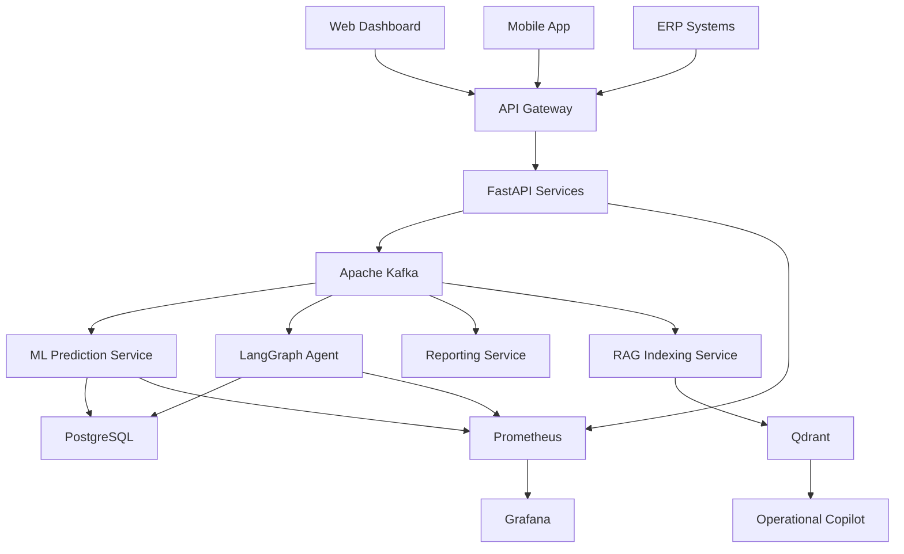
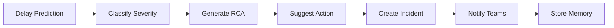

# 🚚 Building an AI-Powered Logistics Command Center as a Solo Engineer

### How I designed and built a production-grade AI logistics platform using Kafka, LangGraph, FastAPI, Qdrant, Kubernetes, and AWS

---

## 📊 Project Snapshot

**Industry:** Logistics & Supply Chain

**Architecture Style:** Event-Driven Microservices

**Scale Target:**

* Hundreds of vehicles
* Multiple warehouses
* Hundreds of thousands of monthly shipments

**Core Technologies:**

* FastAPI
* Apache Kafka
* PostgreSQL
* Redis
* LangGraph
* Qdrant
* XGBoost
* Kubernetes (EKS)
* Terraform

**Key Outcomes:**

* Automated delay prediction
* AI-powered incident response
* Natural language operational copilot
* Real-time executive reporting
* End-to-end observability

---

## 📚 Table of Contents

1. The Problem
2. Why a Traditional Dashboard Would Fail
3. Architecture Philosophy
4. System Overview
5. The 10 Core Modules
6. AI Incident Management
7. Building the RAG Copilot
8. Cloud Infrastructure
9. Security Architecture
10. Lessons Learned

---

# The Problem

A few months ago, I was presented with a challenge that looked deceptively simple:

> "Can you help us track shipments better?"

At first glance, it sounded like a dashboard problem.

It wasn't.

The company operated a growing freight network with:

* Hundreds of active vehicles
* Multiple warehouses
* Thousands of shipments moving simultaneously
* Several disconnected operational systems

Yet the operations team still relied heavily on spreadsheets, WhatsApp groups, manual reports, and reactive decision-making.

The consequences were expensive.

### ⚠ Pain Point #1: Delays Were Discovered Too Late

Operations managers often learned about shipment delays hours after they had already impacted customers.

By the time someone noticed:

* Delivery windows were missed
* Customers were frustrated
* Escalations had already started

---

### ⚠ Pain Point #2: Customer Support Was Overwhelmed

Support teams spent a significant portion of their day answering:

> "Where is my shipment?"

The information existed.

But it wasn't accessible quickly enough.

---

### ⚠ Pain Point #3: No Real-Time Visibility

Managers received reports at the end of the day.

The problem?

Operations happen in real time.

By the time reports arrived, the opportunity to intervene had already passed.

---

### ⚠ Pain Point #4: Incident Management Was Manual

When delays occurred:

* Someone manually created a ticket
* Someone manually categorized it
* Someone manually escalated it
* Someone manually informed stakeholders

The process was slow and inconsistent.

---

# The Real Goal

The client didn't need another dashboard.

They needed a digital nervous system.

A platform capable of:

✅ Understanding events in real time

✅ Predicting problems before they happen

✅ Automatically creating incidents

✅ Assisting operators with AI

✅ Delivering executive insights automatically

---

# Architecture Philosophy

Before writing a single line of code, I made one critical architectural decision:

## Everything Must Be Event Driven

Every meaningful action in the system becomes an event.

Examples:

* Shipment updated
* Vehicle location changed
* Delay predicted
* Incident created
* Alert generated

Instead of tightly coupling services together:

```text
Service A → Service B → Service C
```

I designed the platform around a shared event backbone:

```text
Service A → Kafka
                 ↓
       Service B
       Service C
       Service D
```

This approach gave several advantages:

### 🚀 Independent Scalability

Each service scales based on its own workload.

The ML service can scale without touching the API layer.

---

### 🚀 Fault Isolation

If reporting fails:

The shipment ingestion pipeline keeps running.

If the AI agent fails:

The tracking system remains operational.

---

### 🚀 Extensibility

Adding new features becomes easy.

Need a fraud detection service?

Simply consume Kafka events.

No changes required elsewhere.

---

### 🚀 Event Replay

Kafka acts as a historical source of truth.

Any service can replay events and rebuild state.

This becomes invaluable for debugging and analytics.

---

# High-Level Architecture



---

# The 10 Core Modules

## 📦 Module 1: Shipment Ingestion Service

### Purpose

Acts as the entry point for all operational data.

Sources include:

* GPS telemetry
* Warehouse systems
* Third-party logistics partners
* ERP integrations

### Technology Stack

* FastAPI
* PostgreSQL
* Redis
* SQLAlchemy Async
* Kafka Producer

### Biggest Engineering Challenge

Handling duplicate events.

GPS systems are noisy.

Retries happen constantly.

Without protection:

```text
GPS Retry
    ↓
Duplicate Event
    ↓
Duplicate Shipment Update
    ↓
Incorrect Analytics
```

### Solution

Implemented idempotency using:

```text
SHA256(
 shipment_id +
 timestamp
)
```

Stored in Redis with TTL.

Duplicate events return instantly without processing.

---

## 🧠 Module 2: Apache Kafka Event Backbone

Kafka became the central nervous system of the platform.

Every service communicates through events.

### Why Kafka?

Alternatives considered:

❌ RabbitMQ

❌ AWS SQS

Chosen:

✅ Kafka

Reasons:

* Event replay
* High throughput
* Ordering guarantees
* Horizontal scalability
* Durable history

---

## 🤖 Module 3: Delay Prediction Engine

One of the most impactful modules.

The objective:

Predict shipment delays before customers experience them.

### Input Features

| Feature            | Source              |
| ------------------ | ------------------- |
| Distance Remaining | GPS                 |
| Driver Performance | Historical Data     |
| Route Delay Trends | Analytics           |
| Weather Conditions | Weather API         |
| Warehouse Backlog  | Operational Metrics |
| Shipment Weight    | Metadata            |

### Model

XGBoost Regressor

Output:

```json
{
  "delay_probability": 0.81,
  "estimated_delay_hours": 3.2
}
```

Inference target:

⚡ Less than 100ms

---

## 🚨 Module 4: AI Incident Management Agent

When delays cross predefined thresholds:

The AI system takes over.

### Workflow



### Severity Classification

| Level    | Delay     |
| -------- | --------- |
| Low      | <1 Hour   |
| Medium   | 1-3 Hours |
| High     | 3-6 Hours |
| Critical | >6 Hours  |

The classification remains rule-based.

Production systems should not allow LLMs to determine operational severity.

---

## 🔍 Module 5: Operational Copilot

This became my favorite component.

Operators can ask:

> Which warehouse caused the most delays this week?

Or:

> Show all critical incidents from Mumbai routes.

And receive grounded answers with citations.

### Architecture

```text
User Query
    ↓
Intent Classification
    ↓
Hybrid Retrieval
    ↓
Re-ranking
    ↓
LLM Generation
    ↓
Response + Citations
```

### Why Hybrid Search?

Pure vector search struggles with:

```text
SHP-93214
```

Exact identifiers.

Hybrid retrieval combines:

✅ BM25

✅ Dense Embeddings

Result:

Higher accuracy and better operational relevance.

---

## 📈 Module 6: Automated Executive Reports

Every evening:

The platform automatically generates:

* KPI summaries
* Incident analysis
* Delay trends
* Executive narratives

Reports are distributed through:

* Email
* Slack
* Cloud Archive

Without any human intervention.

---

## ⚙ Module 7: Worker Service

Responsible for:

* Alerting
* Escalations
* Scheduled tasks
* Synchronization jobs

The heart of this service is an incident state machine:

```text
OPEN
 ↓
ACKNOWLEDGED
 ↓
IN_PROGRESS
 ↓
RESOLVED
```

With automated escalation paths.

---

## 📊 Module 8: Observability Platform

A production system without observability is a black box.

Monitoring stack:

* Prometheus
* Grafana
* Loki
* Fluent Bit

### Dashboards

1. Fleet Operations
2. AI Health
3. Infrastructure Health
4. Incident Command Center
5. Executive KPI Dashboard

---

## ☁ Module 9: Cloud Infrastructure

Infrastructure was built entirely through Terraform.

### AWS Components

* EKS
* RDS PostgreSQL
* ElastiCache Redis
* ECR
* MSK
* Secrets Manager

### Deployment Strategy

```text
Git Push
   ↓
GitHub Actions
   ↓
Docker Build
   ↓
Security Scan
   ↓
ECR
   ↓
EKS Deployment
```

Fully automated.

---

## 🔐 Module 10: Security Architecture

Security was treated as a first-class feature.

### Implemented Controls

* JWT Authentication
* RBAC Authorization
* Secrets Manager
* Container Scanning
* Network Policies
* Dependency Scanning
* Audit Logging

---

# Key Production Metrics

| Metric             | Target  |
| ------------------ | ------- |
| API Latency        | <100ms  |
| ML Inference       | <100ms  |
| Incident Creation  | <10s    |
| Availability       | 99.9%   |
| Kafka Consumer Lag | <1000   |
| Report Generation  | <5 mins |

---

# Lessons Learned

## Lesson 1

Event-driven architecture scales organizations better than tightly coupled systems.

---

## Lesson 2

LangGraph provides significantly better control and observability than traditional LLM chains.

---

## Lesson 3

Hybrid retrieval is essential for enterprise operational data.

Pure vector search is rarely enough.

---

## Lesson 4

Failures should be expected.

Design for them from day one.

Use:

* DLQs
* Circuit Breakers
* Retries
* Fallback Models
* Idempotency

---

## Lesson 5

The AI model is only a small part of the system.

The real challenge lies in:

* Infrastructure
* Reliability
* Security
* Observability
* Scalability

---

# Final Architecture Summary

The completed platform consisted of:

✅ 10 Microservices

✅ Apache Kafka Event Backbone

✅ XGBoost Delay Prediction

✅ LangGraph Incident Agent

✅ Qdrant-Powered RAG Copilot

✅ Kubernetes Infrastructure

✅ Full Observability Stack

✅ Automated Reporting

✅ Enterprise Security Controls

---

## Closing Thoughts

Building production-grade AI systems is rarely about the model itself.

Most engineering effort goes into everything around the model:

* Data pipelines
* Infrastructure
* Monitoring
* Security
* Reliability
* Operational workflows

The result was not just another dashboard.

It was an intelligent operations platform capable of predicting issues, coordinating responses, and helping humans make better decisions in real time.

And that, ultimately, was the real goal.
